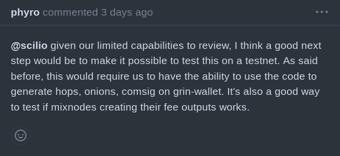
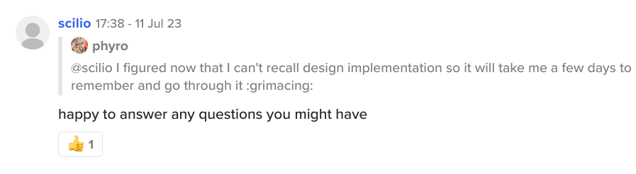

# Community Meeting Notes September 12, 2023

Community Council (CC) meeting held @ 15:00 UTC in grincoin#general channel on Keybase. Meeting lasted 45  min.

Notes are truncated, and conversations sorted based on topic and not always chronological. Quotes are edited for brevity and clarity, and not always exact.

### _Community attendance:_

* waynegeorge
* l33d4n
* ardocrat
* anonymous
* cekickafa
* phyro
* mattczt3

# Short Summary
 
-   Current Grincc election status is being mentioned. 
 -  Mwixnet current status is being discussed 
 -  Current status of Grin++ release and testing is being discussed.
 

# Agenda Points & Actions
 

* Last meeting notes here: https://github.com/grincc/agenda/tree/main/notes

* Current meeting [agenda](https://github.com/grincc/agenda/issues/105)

__cekickafa__ : Ok, lets wait 2 min more and start.

__ardocrat__ : How is election process going? seems like @trinitron and trab will be new CC members?

__cekickafa__ : yes, trab and @trinitron is going ahead. We have 3 candidates.

__l33d4n__ : 👋

__ardocrat__ : Danilla also?

__cekickafa__ Danilla also 👍

__ardocrat__ :  He has some problem with Chinese people as I noticed                  I am not sure he will pass
But it's OK

__cekickafa__ : trab, trinitron and danilla.

>__ardocrat__ :  He has some problem with Chinese people as I noticed  

i wiil remind him code of conduct.

👍 ardocrat

__waynegeorge__ : I'm still not clear on how to vote. I see some requests for candidacy but not a place to vote.

👍 ardocrat

__anynomous__ : 👋  I am here but not for long.

👋  ardocrat, cekickafa

__cekickafa__ : 

>__waynegeorge__ : I'm still not clear on how to vote. I see some requests for candidacy but not a place to vote.

you give likes.

__waynegeorge__ : Where do you give likes?

__cekickafa__ : his/her candidacy post on forum page.

__ardocrat__ :

>__waynegeorge__ : Where do you give likes?

on forum it seems.

__anynomous__ : Voting happens purely on the forum, by liking the candidates post. I linked to all three candidate posts, also those links are in the newsletter.

__waynegeorge__ : ok that works I guess.

__anynomous__ : Everyone can vote, but only votes from community trust members with trust level 1 or higher are counted.
Also you can provide feedback or endorsement by commenting below the candidates post.
Negative voting, by liking multiple candidates is allowed.

__cekickafa__ : https://open.substack.com/pub/grinpost/p/community-council-candidates

3 links  here @waynegeorge

__waynegeorge__ : Thank you, it's much clearer now.

__ardocrat__ :

>__anynomous__ : Everyone can vote, but only votes from community trust members with trust level 1 or higher are counted.

I am just a spectator, will not put any likes, tho I support @trinitron as he has some critical views, he doesn't agree with everything, trab - I don't know this guy :)

__l33d4n__ : I have 2 questions (and hopefully to get answers) that I want to include in the meeting notes:

1. The miners off for almost 5 months now. What is the status of the community miners? Who is responsible for the communication with the operator and when was the last communication?

2. What is the status of @dtavarez last funded tasks? Based on the GitHub activity, 4 months have passed since the last commit (9 months since the beginning of the funding). Is anyone following it? And if so, right now, what this funding provided? Is there anything the community can check or try?

👍 ardocrat

__ardocrat__ : About GK role - can @cekickafa make some notes about progress of bounties, funding requests, so we will know if something is stucked and maybe needs a help at development etc.

__waynegeorge__ : Cobragrin is the current GK right?

👍 ardocrat

__ardocrat__ : Some kind of project management at funding requests/bounties is needed..

__waynegeorge__ : @l33d4n I think they are very important questions.

👍 ardocrat, l33d4n

__cekickafa__ : https://github.com/cekickafa/docs-1/blob/main/funded_requests_progress.md funded requests updated here. Mwixnet is being reviewed and davidtavarez tasks are linked but still not a product to test and documentation is not done.
He said bugs occur and he want to test more before relase.

__l33d4n__ : 

>__waynegeorge__ : @l33d4n I think they are very important questions.

We are lucky that I visit here every few months to ask the same questions. "WHAT WE GOT FOR WHAT WE FUNDED?". any of the members here should follow it on regularly.

__waynegeorge__ : I'm happy to take up a task if there's something I can look into/check up on if I can. Such as progress on a feature

👍 ardocrat

__ardocrat__ :

I see @phyro comment about limited capabilities, maybe some extra dev help is needed.

__l33d4n__ : 

>__cekickafa__ : https://github.com/cekickafa/docs-1/blob/main/funded_requests_progress.md funded requests updated here. Mwixnet is being reviewed and davidtavarez tasks are linked but still not a product to test and documentation is not done.

The tasks "linked" to a PRs whose last activity was 4 months ago. Is there any update since then?

__ardocrat__ :

>__waynegeorge__ : I'm happy to take up a task if there's something I can look into/check up on if I can. Such as progress on a feature

Me too, if devs need help with testing, development, we (community) are here.

 
__cekickafa__ : 

>__l33d4n__ : The tasks "linked" to a PRs whose last activity was 4 months ago. Is there any update since then?

Last update from Davidt is June 15. Since there is no update.

__ardocrat__ :

👋 @scilio

__cekickafa__ : i am talking according to his github, pull request  was in May.
Scilio last update is on May 23, he didnt respond yet.

__ardocrat__ : I saw him at July.

__l33d4n__ : 

>__cekickafa__ : Last update from Davidt is June 15. Since there is no update.

So what's the plan? someone, maybe the CC members or the GK are planning to contact him to ask? 4-5 months without any update?

__ardocrat__ : 

__cekickafa__ : Scilio s work depends on delivered work-bounty by the way. He didnt get 3rd final bounty.

👍 ardocrat

>__l33d4n__ : So what's the plan? someone, maybe the CC members or the GK are planning to contact him to ask? 4-5 months without any update?

We are waitin him to release the grin++ to test and use.

__waynegeorge__ : 

>__l33d4n__ : So what's the plan? someone, maybe the CC members or the GK are planning to contact him to ask? 4-5 months without any update?

Does he owe something?

__anynomous__ : Yep. Only when reviewed and approved will the bounty be paid. There is no time req requirement or anything, both for deliverables and review. Just whenever one has time to do so.

👍 cekickafa

__cekickafa__ :

>__waynegeorge__ : Does he owe something?

He was paid upfront. If you ask.

__ardocrat__ : 

>__anynomous__ : Yep. Only when reviewed and approved will the bounty be paid. There is no time req requirement or anything, both for deliverables and review. 

This is good thing, but he is not alone here, we can help to speed up some things, like what @phyro mentioned :)

👍 cekickafa

__l33d4n__ :

>__cekickafa__ : We are waitin him to release the grin++ to test and use.

I'm asking that one of the CC or the GK request an update for the next meeting. What is the status of these tasks, and if there is a problem, what exactly is it? Both @waynegeorge and @ardocrat offered to help.

__ardocrat__ : 

>__ardocrat__ : This is good thing, but he is not alone here, we can help to speed up some things, like what @phyro mentioned :)

As I see he is waiting for review for 2 months..

__l33d4n__ : Just let's get clear update about what is going on for the next meeting.
I have to go guys. See you next time.

👋 ardocrat, waynegeorge

__ardocrat__ : 

>__l33d4n__ : I'm asking that one of the CC or the GK request an update for the next meeting. What is the status of these tasks, and if there is a problem, what exactly is it? Both @waynegeorge and @ardocrat offered to help.

I have no success with building Grin++ Desktop on Arch Linux sadly, I can test binaries.

__cekickafa__ : Ok, next meeting topics will be added. Next time, please add topics to agenda before the meeting. Related person can join and answer.

__ardocrat__ : I mean we can discuss this every meeting as reminder
by default - progress of current tasks :)

👍 cekickafa

__waynegeorge__ : I saw some chat previously about the testnet. Is all ok with it?

__ardocrat__ : yes for now, its mining.

__phyro__ : just jumping in to make it clear that scilio asked me regarding the review status in early august. I just had less time on grin since then and it seems a lot of others are busy with their own things too. It's just the state of things today so if anyone can help review, jump on the PR, you can even ask questions regarding mwixnet on the forum and I'll gladly answer them. We need to distribute knowledge anyway.

🙏🏻 cekickafa, waynegeorge ❤️ ardocrat, scilio

__cekickafa__ :

>__waynegeorge__ : I saw some chat previously about the testnet. Is all ok with it?

Testnet functions now thanks to @johndavies24 and @mattczt3.

👍   waynegeorge

So we held 2nd topic '' Testnet''

__waynegeorge__ : Thanks @phyro. I'll take a look and try to ask some questions
mwixnet for dummies

👍 cekickafa, phyro

__cekickafa__ : Ok other topic 

## 1)  GK funding request Sept-December 2023
Given the current ongoing election process and the insufficient number of CC participants, it is more suitable to postpone the discussion of this matter to the next meeting maybe. The introduction of new members to the CC presents an opportunity for a fresh start, enabling community to make healthier decisions.

👍 ardocrat

Or if you have questions, anything now..

__mattczt3__ :

>__cekickafa__ : Testnet functions now thanks to @johndavies24 and @mattczt3.

Navie is still having problems, let's not forget to thank him for highlighting the issues

💯 waynegoerge

__waynegeorge__ : One last thing about those miners, is there someone best to answer about them? Or are they considered lost?

__cekickafa__ : 

>__mattczt3__ :Navie is still having problems, let's not forget to thank him for highlighting the issues

yes, thanks for reminding, he helped too much.🙏

__ardocrat__ :

>__waynegeorge__ : One last thing about those miners, is there someone best to answer about them? Or are they considered lost?

As I understood community accepted this loss.

__cekickafa__ : my personal view, it is not under our custody, we will be lucky if we get hashrate from those miners.

__ardocrat__ : No answer from mining center and it will be expensive to bring them back anyway..
Next time we should make our own firmware with kill-switch :D

💯 waynegoerge

But it will be no more mining projects I guess, as @anynomous said

__waynegeorge__ : Fair enough. Just so @l33d4n can cross it off his list.

__cekickafa__ : it seems so.

__ardocrat__ : 

>__waynegeorge__ : Fair enough. Just so @l33d4n can cross it off his list.

list of rugs? :D
we can make some memes about this. forget and forgive.

__cekickafa__ : Rugs will happen. We need to prevent them before it happens.

💯 ardocrat 👍 ardocrat

__waynegeorge__ : IMO the community has done well. 10 BTC spent is great considering how bad it could've been.

__cekickafa__ : Yes, it was a community decision, it went well 1 year. But outcome final is that way.
Ok, meeting topics are covered. Feel free to discuss if you have anything on mind.. Thanks for joining.🔨

 
## *TO DO List*

* Follow up current status of Grin++ upgrade @davidtavarez. 
* Follow up current status of Mwixnet @scilio.

**Meeting adjourned.**

