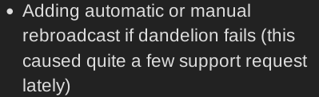

# Community Meeting Notes December 19, 2023

Community Council (CC) meeting held @ 18:30 UTC in grincoin#general channel on Keybase. Meeting lasted 30 min.

Notes are truncated, and conversations sorted based on topic and not always chronological. Quotes are edited for brevity and clarity, and not always exact.

### _Community attendance:_

* waynegeorge
* cekickafa
* ardocrat

# Short Summary
 
 
- Unconfirmed transaction problem mentioned.

# Agenda Points & Actions
 

* Last meeting notes here: https://github.com/grincc/agenda/tree/main/notes

* Current meeting [agenda](https://github.com/grincc/agenda/issues/119)

## Unconfirmed transactions

__waynegeorge__ : I’m just looking to see what the unconfirmed TXs is about. Is it unique to g++?

__cekickafa__ : Not i think. Sometimes you need to rebroadcast the transaction becuz of dandelion i think. I am not expert tough. I might be mistaken.
But clearly it is a problem for user.

__waynegeorge__ : Last time I was here there was a conversation about mwix testing. I haven’t caught up on forum but I’m wondering how it’s going?

__cekickafa__ : @scilio made an update, keybase://chat/grincoin#dev/24808

 

__waynegeorge__ : Amazing, thanks. Seems quiet here today, but a topic that I wanted to bring up at some point was regarding creating a team to do things such as testing and support. As I understand, currently Yeastplume is the only core developer and you are the groundskeeper. Other than that there is nobody else getting paid to work on the project. I wonder if this needs to change dramatically in order to grow grin

__ardocrat__ : yo

  I like this idea, will try to implement at node level if possible, wallet is easier, but affects usability :)

👍   cekickafa, waynegoerge

__cekickafa__ : Well, i am mostly doing the leg work and record keeping and some ecoystem monitoring stuff. Scilio is paid on bounty mwixnet only. I am not technical much but i constantly get feedback from users via dm, Tg channel etc. Testing and support team about specific something or?

__ardocrat__ : 

>__waynegeorge__ : I’m just looking to see what the unconfirmed TXs is about. Is it unique to g++?

nope, same bug was noticed at Beam as well, Dandelion related possibly

__cekickafa__ : Beam as well ? i didnt know this. Then this is not related to grin++ only

💯 ardocrat, anonymous

__ardocrat__ :  Yeah, saw reports at their support chat

__cekickafa__ : Auto rebroadcast implemented on core wallet or?

__ardocrat__ : not implemented.just an idea. to autobroadcast you need to keep wallet open. node level is just better for usability

👍 cekickafa

__waynegeorge__ : 

>__cekickafa__ : Well, i am mostly doing the leg work and record keeping and some ecoystem monitoring stuff. Scilio is paid on bounty mwixnet only. I am not technical much but i constantly get feedback from users via dm, Tg channel etc. Testing and support team about specific something or?

 I’m thinking managing nodes, building some test scripts. Basically just getting their hands dirty and reporting issues in a clear, structured way

👍 cekickafa

__cekickafa__ : @tromp @yeastplume @phyro @dtavarez can comment on this

__waynegeorge__ : I’d love to do more but with a 9-5 and side project, there’s no “free” time

__ardocrat__ : same here, I am finishing side project before new year to come back to grin :)
time is moving really fast, the most precious resource

__cekickafa__ : Well, happy new year to you all by the way. Last meeting of 2023.

❤️ardocrat, waynegoeroge

__ardocrat__ : next year will be 🔥

:christmasgrin:

__cekickafa__ : @waynegeorge if i can help you with your idea, i will be glad. Ping me anytime. Thanks for joining.

❤️waynegoerge

__anonymous__ : Happy new year all. Sorry, too bussy with kids for meeting.

👋 cekickafa, ardocrat, waynegeorge, syntajax, mably, tromp,phyro, hellohigh

## *TO DO List*

*

**Meeting adjourned.**