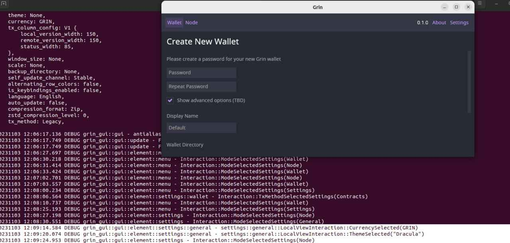

# Community Meeting Notes January 02, 2024

Community Council (CC) meeting held @ 18:30 UTC in grincoin#general channel on Keybase. Meeting lasted 30 min.

Notes are truncated, and conversations sorted based on topic and not always chronological. Quotes are edited for brevity and clarity, and not always exact.

### _Community attendance:_

* anonymous
* cekickafa
* trinitron

# Short Summary
 
 
- Future of ironbelly mobile wallet has been discussed.

# Agenda Points & Actions
 

* Last meeting notes here: https://github.com/grincc/agenda/tree/main/notes

* Current meeting [agenda](https://github.com/grincc/agenda/issues/120)

## Ironbelly wallet status

__anonymous__ : I’m just looking to see what the unconfirmed TXs is about. Is it unique to g++?

A new year, a clean slate (pack), a clean agenda:
https://github.com/grincc/agenda/issues/120

My messages also take a bit longer than usual.
Is there anything any of you would like to add to the agenda or just informally want to discuss?

__Cekickafa__ : Well we can edit agenda acc to discussion. The ironbelly situation or GUI wallet priority if you ask me.

__anonymous__ : A, yes. To me it is an obvious case of the need to ask funding ones in a while. Not for support, just to keep things up to date.
I think as a community we can handle support. Ivan probably feels like he has to help there, but he can just send them to the forum, telegram etc.
That is just my opinion.
But probably best to time the update of iron belly to match the update of grin wallet/release of grin gui wallet.

Perhaps Grin++ could also plan a maintenance update around that time.
Did you try GUI wallet @cekickafa?
I did not, holiday priorities right now.
Looks like messages are not getting through😅

__cekickafa__ :Yes i tried. I loaded but buttons didnt work for me:) . I tried

👍 anonymous
__trinitoron__ : Hey guys, for this new grin year I have added a calendar item to remind me of the meeting! But I am bad at time zone math. Did it start 50 minutes ago or in 10 minutes from now?
Or 20 minutes ago?

__anonymous__ : 24 min

__trinitoron__ : thank you anony Yaa, I always have to calculate it as well and more than ones ended up an hour too early 😅

I have fixed my calendar entry! And I look forward to not being missing anymore.

__cekickafa__ : 

__trinitoron__ : Thank you @anynomous and @cekickafa for basically carrying CC through the end of 2023.

👍 cekickafa

__cekickafa__ : I mean it is  not clicking.

__anonymous__ :  ok. Your running on Ubuntu right? It is mainly developed for Windows, probably some dependency issue.

__cekickafa__ :  yes i guess so.it is ubuntu

__trinitoron__ : Only thing I have in particular to add is to restate my position on the ironbelly situation: I think Ivan is the only one who can maintain and if something like funding a day of work a month would help him do that, I would support that. But I agree with him that otherwise, the only practical option is to pull ironbelly.

__anonymous__ : You mean put it offline if he feels he cannot keep it up to date enough to be safe?
I mean, support is something he can/could drop anyway
Since Iron belly is basically just a GUI, and in the back it's grin-wallet and node, I wonder how much a security risk it actually is.

__cekickafa__ :  Put it offline, you mean remove from the android /ios store?
Becuz it can be downloaded also unofficial i think
__anonymous__ :  That is what I was wondering as well.
It can be. Only if he put the server offline, it would only work if people connect to their own node.
I think the main question is what his main problem is?
Is it support, simply offload.
If it is security concerns - make Funding Requests for maintenance.

__cekickafa__ :  I can help at support channel mostly. No problem.

__anonymous__ : I think we can ask others as well in the community to join that channel to help ones in a while. In any case, we won't know if that is the main issue until @i1skn clarifies what the main problem is.

__cekickafa__ : Mostly maintenance update as you said i think.
@trinitron have problem with keybase?
Spinning loading. Or is it me?
__anonymous__ : I think mostly you. For me it takes a few seconds, which is slower than normal, but ok.
Ok, I am signing off for today.
Cya all.

## *TO DO List*

*

**Meeting adjourned.**